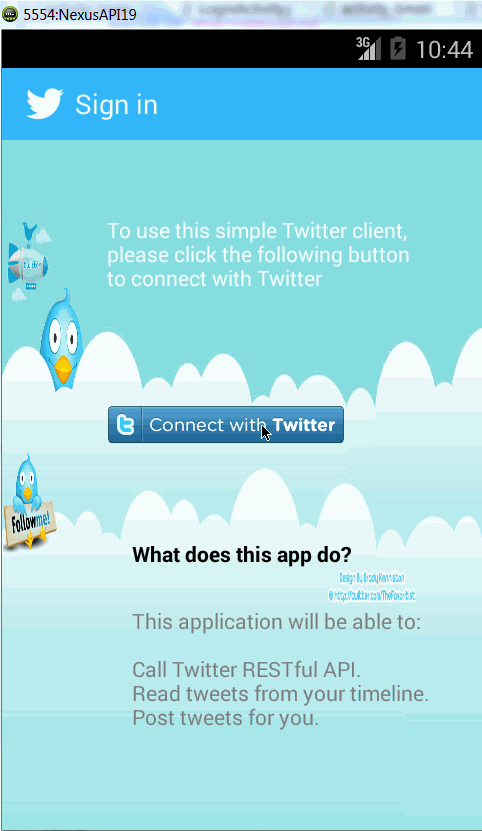

Simple Twitter Client
=====================

This is the third assignment of Android Boot Camp. This app is a simple Twitter client.

Time spent: 30 hours spent in total

Completed user stories (Required):

- User can sign in to Twitter using OAuth login
- User can view the tweets from their home timeline  
 - User should be able to see the username, name, body and timestamp for each tweet
 - User should be displayed the relative timestamp for a tweet "8m", "7h"
 - User can view more tweets as they scroll with infinite pagination
 - **Optional**: Links in tweets are clickable and will launch the web browser (see autolink)

- User can compose a new tweet  - User can click a “Compose” icon in the Action Bar on the top right
 - User can then enter a new tweet and post this to twitter
 - User is taken back to home timeline with new tweet visible in timeline
 - **Optional**: User can see a counter with total number of characters left for tweet

Completed user stories (Optional):
- Improve the user interface and theme the app to feel "twitter branded"
- User can open the twitter app offline and see last loaded tweets 
 - Tweets are persisted into sqlite and can be displayed from the local DB

 
Walkthrough of all user stories:

